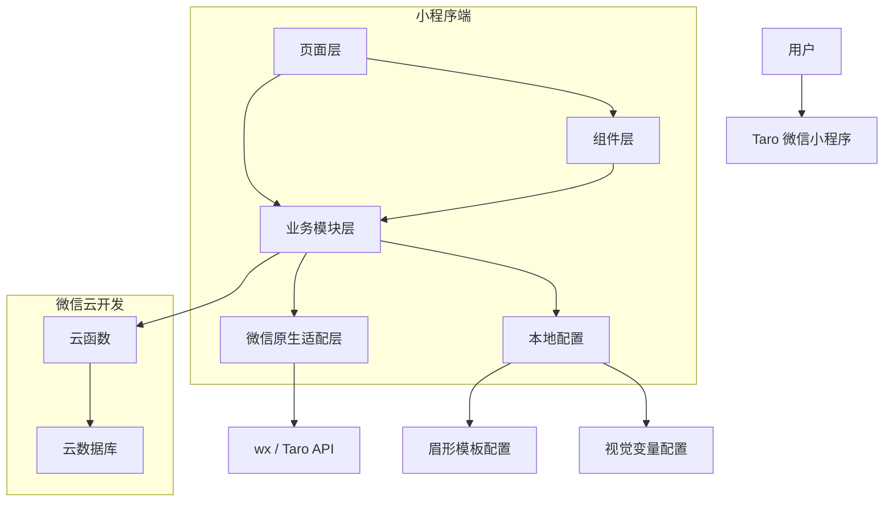
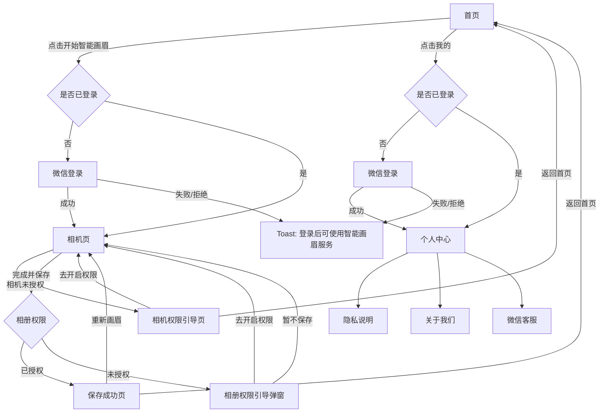
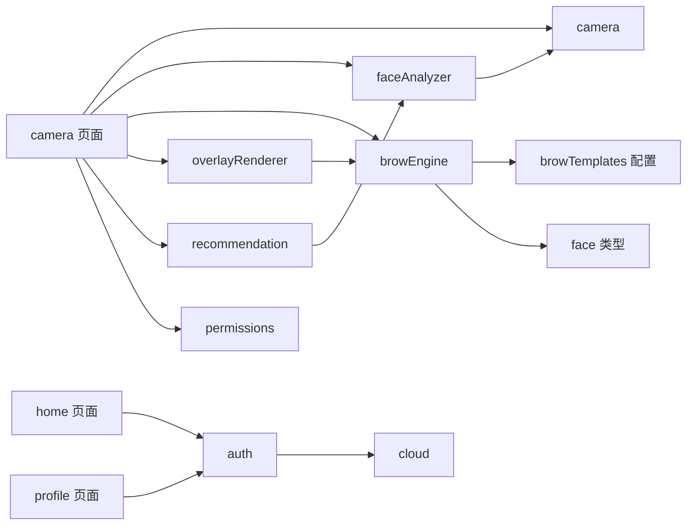
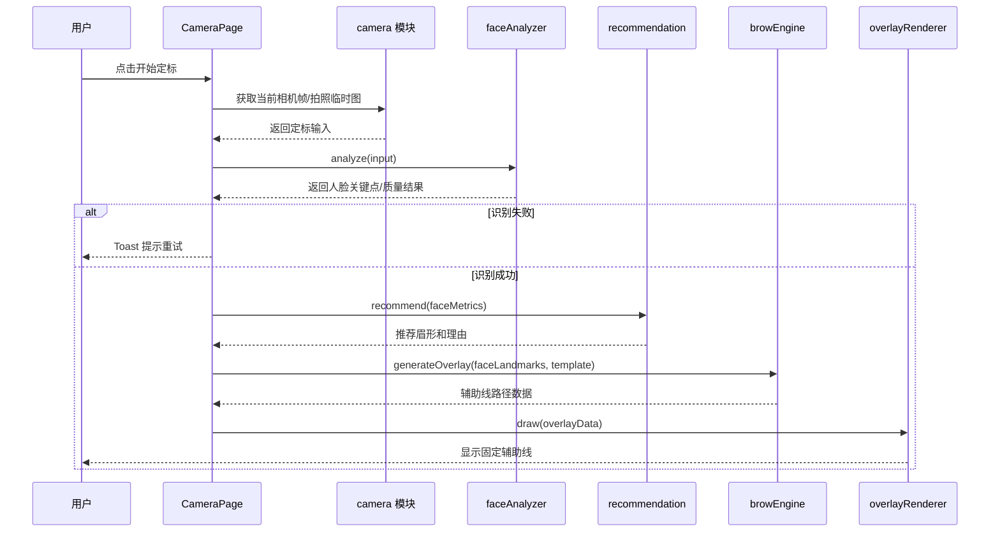
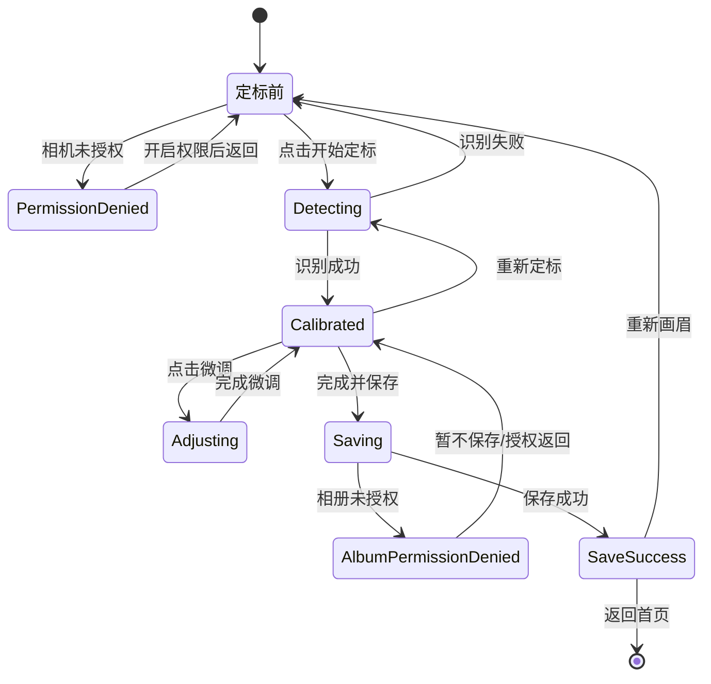
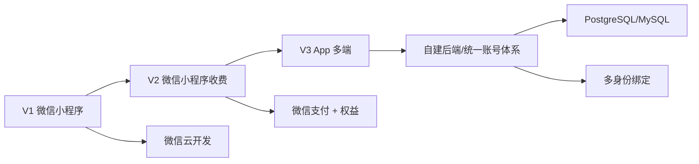

# MS 智能画眉 V1 技术架构设计

## 1. 文档目标

本文档基于《MS 智能画眉 V1 PRD》，用于指导 V1 技术实现、工程拆分和后续扩展。当前阶段目标是先完成微信小程序 MVP，同时为后续 App 多端、会员付费、模板扩展预留清晰边界。

V1 技术原则：

- 优先保证相机体验稳定。
- 前端使用 Taro 提升工程体验和未来多端潜力。
- 相机、权限、Canvas、云开发等关键能力保留微信原生适配层。
- 人脸识别仅在定标瞬间执行一次，画眉过程中不持续跟踪。
- 不上传、不保存用户照片和人脸关键点数据。
- 后端采用微信云开发轻量承载用户身份和后续付费预留。

## 2. 总体技术选型

| 模块 | 选型 | 说明 |
|---|---|---|
| 前端框架 | Taro + React + TypeScript | 兼顾前端开发体验和未来多端扩展 |
| 首发端 | 微信小程序 | V1 优先上线微信生态 |
| UI 方案 | 自定义组件 | 贴合 Figma 定制视觉，不引入重型 UI 库 |
| 样式方案 | SCSS + 设计变量 | 统一美妆工具感和轻科技视觉 |
| 后端 | 微信云开发 | 用于登录、用户资料、后续权益预留 |
| 数据库 | 微信云数据库 | V1 存用户基础信息和轻量偏好 |
| 人脸识别 | 端侧定标识别，先技术 Spike | 不接大模型，不上传照片 |
| 智能推荐 | 本地规则算法 | 根据脸型比例、五官比例推荐眉形 |
| 辅助线绘制 | Canvas 覆盖层，准备 cover-image 兜底 | 绘制固定辅助线、眉形虚线和关键点 |
| 模板配置 | 本地静态配置 | V1 只有 4 个眉形模板 |
| 客服反馈 | 微信客服能力 | 个人中心入口打开客服会话 |

## 3. 总体架构



## 4. 页面架构

V1 页面：

- `home`：首页，引流、产品说明、登录入口、我的入口。
- `camera`：相机定标与画眉辅助核心页面。
- `save-success`：保存成功页。
- `profile`：个人中心。
- `privacy`：隐私说明。
- `about`：关于我们。

页面流程：



## 5. 前端工程结构建议

```text
src/
  app.config.ts
  app.scss
  app.ts
  pages/
    home/
      index.config.ts
      index.scss
      index.tsx
    camera/
      index.config.ts
      index.scss
      index.tsx
    save-success/
      index.config.ts
      index.scss
      index.tsx
    profile/
      index.config.ts
      index.scss
      index.tsx
    privacy/
      index.config.ts
      index.scss
      index.tsx
    about/
      index.config.ts
      index.scss
      index.tsx
  components/
    BrowTemplateCard/
    AdjustPanel/
    PermissionGuide/
    ConfirmModal/
    GuideHero/
    PrimaryButton/
  modules/
    auth/
    cloud/
    camera/
    faceAnalyzer/
    browEngine/
    overlayRenderer/
    recommendation/
    permissions/
    user/
  config/
    browTemplates.ts
    theme.ts
  types/
    brow.ts
    face.ts
    user.ts
    common.ts
cloudfunctions/
  login/
  upsertUser/
```

## 6. 核心模块职责

| 模块 | 职责 | V1 说明 |
|---|---|---|
| `auth` | 登录状态、微信登录、用户初始化 | 调用云函数获取/创建用户 |
| `cloud` | 云函数调用封装 | 统一错误处理和 loading 状态 |
| `camera` | 相机权限、相机上下文、拍照保存 | 保留微信原生 API 适配 |
| `permissions` | 相机/相册授权检查与引导 | 页面和弹窗复用 |
| `faceAnalyzer` | 定标瞬间人脸识别 | 后续可替换实现 |
| `browEngine` | 生成眉形路径、定位线、微调变换 | 与 UI 解耦 |
| `overlayRenderer` | Canvas 绘制辅助线 | 命令式渲染，减少 React 重渲染 |
| `recommendation` | 本地规则推荐眉形和理由 | 不调用云端 AI |
| `user` | 用户资料、偏好读写 | V1 只存轻量偏好 |

模块依赖建议：



## 7. 相机定标核心流程



## 8. 相机页状态机



## 9. 辅助线渲染方案

### 9.1 主方案：Canvas 覆盖层

实现方式：

- 相机画面使用 `camera` 组件。
- 辅助线使用透明 Canvas 覆盖在相机上方。
- 定标成功后将人脸关键点转换为屏幕坐标。
- `browEngine` 生成脸部定位线、五官线、眉形虚线路径和关键点圆点。
- `overlayRenderer` 负责清屏、设置透明度、绘制虚线、绘制圆点。
- 微调滑杆变化时，只更新路径变换并重绘 Canvas。

优点：

- 绘制灵活，适合眉形路径、虚线、圆点、旋转和缩放。
- 模块边界清晰。
- 后续可扩展更多线型和模板。

风险：

- `camera` 属于微信原生组件，覆盖层层级和兼容性需要真机验证。
- 不同机型对 Canvas 覆盖、尺寸映射可能有差异。

### 9.2 兜底方案：透明图片覆盖

实现方式：

- 使用离屏 Canvas 生成透明 PNG 辅助图。
- 用 `cover-image` 覆盖在相机上方。
- 微调时重新生成透明图。

优点：

- 对原生组件层级更友好。
- 展示稳定性可能更高。

缺点：

- 每次微调都要重新生成图片，实时性较弱。
- 复杂交互下性能需要验证。

### 9.3 推荐策略

V1 先实现 Canvas 覆盖层，同时保留渲染接口抽象：

```ts
interface OverlayRenderer {
  draw(data: OverlayData): void
  clear(): void
  resize(width: number, height: number): void
}
```

如果真机测试发现 Canvas 覆盖 `camera` 不稳定，则替换为透明图片渲染实现。

## 10. 人脸识别方案

V1 目标不是专业级美妆 AR，而是定标瞬间识别一次并生成固定辅助线。

### 10.1 识别输入

- 用户点击「开始定标」。
- 获取当前相机帧或临时图片。
- 对图像进行基础质量检查：亮度、脸部完整度、距离、多人脸、正脸程度。

### 10.2 识别输出

V1 至少需要输出：

- 人脸框。
- 双眼位置。
- 鼻梁/鼻尖参考点。
- 眉区参考点。
- 脸部轮廓参考点。
- 正脸/偏转质量判断。

### 10.3 技术策略

开发前必须做技术 Spike，验证微信小程序端可用的人脸关键点能力。

优先级：

1. 优先验证微信小程序可用的端侧人脸检测/关键点能力。
2. 如关键点不足，再评估轻量端侧模型或小程序插件。
3. V1 不采用云端上传照片识别。

### 10.4 降级策略

- 如果关键点精度不足，优先保证眉形模板可微调。
- 如果脸部轮廓点不足，脸部定位线可降级为中线、眼睛水平线和眉区参考框。
- 如果某机型识别失败率高，提示用户调整光线和距离后重试。

## 11. 智能推荐方案

V1 推荐算法使用本地规则。

输入：

- 脸长/脸宽比例。
- 下颌宽度比例。
- 眼距比例。
- 眉眼距离。
- 眉区角度。

输出：

- 推荐眉形：自然眉、标准眉、平眉、弯月眉。
- 推荐理由文案。
- 默认辅助线模板参数。

示例规则：

| 条件 | 推荐 | 理由 |
|---|---|---|
| 脸型偏圆 | 标准眉 | 略带眉峰更显立体 |
| 脸型偏长 | 平眉 | 有助于平衡脸部比例 |
| 脸型柔和且比例均衡 | 自然眉 | 更适合日常妆容 |
| 下颌线偏硬 | 弯月眉 | 柔和眉形可增强亲和感 |

## 12. 云开发方案

V1 云开发能力：

- `login` 云函数：获取 `openid`。
- `upsertUser` 云函数：创建或更新用户基础资料。
- 云数据库集合：`users`、`user_preferences`。

云开发不承载：

- 照片上传。
- 人脸关键点存储。
- 云端 AI 分析。
- 订单支付。
- 正式埋点。

后续收费阶段再扩展：

- `orders` 集合。
- `entitlements` 集合。
- 微信支付回调云函数。
- 会员权益校验云函数。

## 13. 多端扩展边界

因为当前选择 Taro，未来可以考虑扩展 App。但 V1 仍以微信小程序为优先。

需要提前隔离：

- `camera` 模块：不同端相机 API 不同。
- `faceAnalyzer` 模块：不同端可用识别能力不同。
- `overlayRenderer` 模块：小程序 Canvas、App Canvas、Web Canvas 实现可能不同。
- `auth` 模块：微信登录、手机号登录、Apple 登录等身份来源不同。
- `cloud` 模块：微信云开发未来可能替换为自建 API。

多端演进建议：



## 14. 技术 Spike 清单

正式开发前建议先做 1-2 天技术验证。

必须验证：

- Taro 页面中能否稳定打开前置 `camera`。
- 能否在相机上方稳定覆盖 Canvas 或 `cover-image`。
- 能否绘制茶棕色虚线眉形、脸部定位线和关键点圆点。
- 微调滑杆能否实时更新辅助线位置、大小、旋转、透明度。
- 点击保存时能否保存不带辅助线的净图。
- 能否获取满足需求的人脸关键点。
- 安卓真机和 iPhone 真机表现是否可接受。

通过标准：

- 相机打开稳定。
- 覆盖层不闪烁、不错位。
- 保存图片不包含辅助线。
- 定标识别耗时用户可接受。
- 辅助线微调流畅。

## 15. 主要风险与应对

| 风险 | 影响 | 应对 |
|---|---|---|
| 相机原生组件层级限制 | 辅助线无法正常覆盖 | Canvas 主方案 + cover-image 兜底 |
| 人脸关键点能力不足 | 辅助线不准 | 强化微调，降低轮廓线精度要求 |
| 安卓机性能差异 | 卡顿、发热、绘制延迟 | 定标一次，不持续识别；减少重渲染 |
| 保存净图失败 | 用户无法留存结果 | 使用相机原生拍照，不合成辅助线 |
| Taro 抽象层调试复杂 | 排查链路变长 | 关键能力封装为微信原生适配模块 |
| 后续多端账号迁移 | openid 无法跨端 | V1 开始使用自定义 userId |

## 16. 开发顺序建议

1. 技术 Spike：相机、覆盖层、保存净图、人脸识别验证。
2. 初始化 Taro + TypeScript 工程。
3. 建立主题变量和基础组件。
4. 接入微信云开发登录和用户初始化。
5. 开发首页、个人中心、隐私说明、关于我们。
6. 开发相机页初始状态和权限引导。
7. 开发定标识别流程。
8. 开发辅助线渲染和眉形模板切换。
9. 开发微调面板。
10. 开发保存净图和保存成功页。
11. 真机兼容测试和体验调优。
