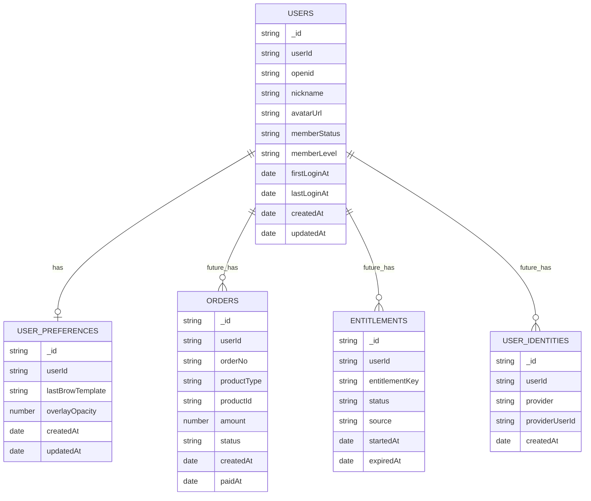
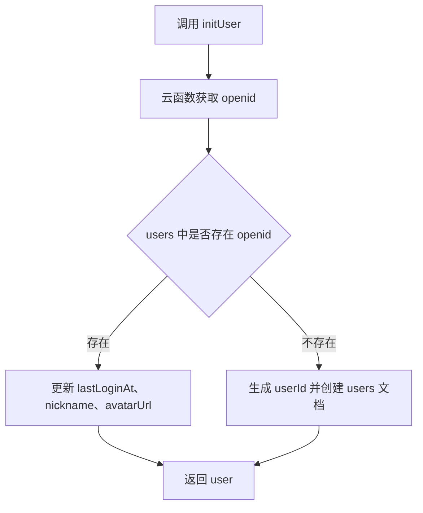

# MS 智能画眉 V1 数据库设计

## 1. 文档目标

本文档定义 MS 智能画眉 V1 在微信云开发中的数据库设计。V1 目标是轻量沉淀用户身份和基础偏好，为后续会员付费、模板权益、多端账号体系预留扩展空间。

V1 数据原则：

- 使用微信云数据库。
- 从第一天生成业务自有 `userId`，不要只依赖微信 `openid`。
- 只保存用户基础资料和轻量偏好。
- 不保存用户照片。
- 不保存人脸关键点。
- 不保存画眉效果历史图。
- 不做正式埋点和订单支付。

## 2. 集合总览

V1 必需集合：

| 集合 | 是否 V1 必需 | 用途 |
|---|---|---|
| `users` | 是 | 用户基础资料、登录时间、会员预留字段 |
| `user_preferences` | 建议 | 用户轻量偏好，如上次眉形、辅助线透明度 |

V2/收费阶段预留集合：

| 集合 | 阶段 | 用途 |
|---|---|---|
| `orders` | V2 | 会员或模板购买订单 |
| `entitlements` | V2 | 用户权益、会员、模板包权限 |
| `brow_templates_remote` | V2/V3 | 服务端模板配置 |
| `user_identities` | V3 | 多端多登录方式身份绑定 |

集合关系：



## 3. `users` 集合

### 3.1 用途

保存用户基础身份信息、登录时间和会员预留字段。

### 3.2 字段设计

| 字段 | 类型 | 必填 | 示例 | 说明 |
|---|---|---|---|---|
| `_id` | string | 是 | 云数据库自动生成 | 云数据库文档 ID |
| `userId` | string | 是 | `usr_20260617_xxx` | 业务自有用户 ID，后续多端扩展使用 |
| `openid` | string | 是 | `oxxxxxx` | 微信小程序 openid |
| `nickname` | string | 否 | `小眉` | 用户微信昵称 |
| `avatarUrl` | string | 否 | `https://...` | 用户微信头像 |
| `memberStatus` | string | 是 | `free` | 会员状态，V1 默认为 `free` |
| `memberLevel` | string | 是 | `free` | 会员等级，V1 默认为 `free` |
| `firstLoginAt` | date | 是 | `2026-06-17T10:00:00.000Z` | 首次登录时间 |
| `lastLoginAt` | date | 是 | `2026-06-17T10:00:00.000Z` | 最近登录时间 |
| `createdAt` | date | 是 | `2026-06-17T10:00:00.000Z` | 创建时间 |
| `updatedAt` | date | 是 | `2026-06-17T10:00:00.000Z` | 更新时间 |

### 3.3 示例文档

```js
{
  _id: "cloud_doc_id",
  userId: "usr_20260617_a8f3k2",
  openid: "oAbc123456789",
  nickname: "小眉",
  avatarUrl: "https://example.com/avatar.png",
  memberStatus: "free",
  memberLevel: "free",
  firstLoginAt: new Date("2026-06-17T10:00:00.000Z"),
  lastLoginAt: new Date("2026-06-17T10:00:00.000Z"),
  createdAt: new Date("2026-06-17T10:00:00.000Z"),
  updatedAt: new Date("2026-06-17T10:00:00.000Z")
}
```

### 3.4 字段枚举

`memberStatus`：

| 值 | 说明 |
|---|---|
| `free` | 普通用户，V1 默认 |
| `trial` | 试用会员，后续预留 |
| `active` | 有效会员，后续预留 |
| `expired` | 会员已过期，后续预留 |
| `blocked` | 账号限制，后续预留 |

`memberLevel`：

| 值 | 说明 |
|---|---|
| `free` | 普通用户 |
| `plus` | 轻会员，后续预留 |
| `pro` | 高级会员，后续预留 |

### 3.5 索引建议

| 字段 | 唯一 | 用途 |
|---|---|---|
| `openid` | 是 | 根据微信身份查找用户 |
| `userId` | 是 | 业务主用户 ID |
| `lastLoginAt` | 否 | 后续运营或活跃用户查询 |

## 4. `user_preferences` 集合

### 4.1 用途

保存用户轻量使用偏好。该集合不保存照片、不保存人脸数据，只保存非敏感偏好。

V1 可以建表但不一定强依赖使用。如果开发想进一步简化，也可以先只保留设计，等 V1.1 再启用。

### 4.2 字段设计

| 字段 | 类型 | 必填 | 示例 | 说明 |
|---|---|---|---|---|
| `_id` | string | 是 | 云数据库自动生成 | 云数据库文档 ID |
| `userId` | string | 是 | `usr_20260617_xxx` | 关联 `users.userId` |
| `lastBrowTemplate` | string | 否 | `standard` | 上次选择的眉形模板 |
| `overlayOpacity` | number | 否 | `0.8` | 上次辅助线透明度，范围 0.2-1 |
| `createdAt` | date | 是 | `2026-06-17T10:00:00.000Z` | 创建时间 |
| `updatedAt` | date | 是 | `2026-06-17T10:00:00.000Z` | 更新时间 |

### 4.3 示例文档

```js
{
  _id: "cloud_doc_id",
  userId: "usr_20260617_a8f3k2",
  lastBrowTemplate: "standard",
  overlayOpacity: 0.8,
  createdAt: new Date("2026-06-17T10:00:00.000Z"),
  updatedAt: new Date("2026-06-17T10:00:00.000Z")
}
```

### 4.4 字段枚举

`lastBrowTemplate`：

| 值 | 说明 |
|---|---|
| `natural` | 自然眉 |
| `standard` | 标准眉 |
| `straight` | 平眉 |
| `arched` | 弯月眉 |

### 4.5 索引建议

| 字段 | 唯一 | 用途 |
|---|---|---|
| `userId` | 是 | 每个用户一份偏好 |

## 5. 云函数设计

V1 建议云函数：

| 云函数 | 用途 | 输入 | 输出 |
|---|---|---|---|
| `login` | 获取微信 openid | 无 | `openid` |
| `upsertUser` | 创建或更新用户 | `nickname`、`avatarUrl` | `user` |
| `getUserProfile` | 获取当前用户资料 | 无 | `user` |
| `updateUserPreference` | 更新用户偏好 | `lastBrowTemplate`、`overlayOpacity` | `success` |

如果想进一步简化，`login` 和 `upsertUser` 可以合并成一个 `initUser` 云函数。

推荐 V1 使用：

```text
initUser
getUserProfile
updateUserPreference
```

## 6. `initUser` 云函数逻辑



输入：

```js
{
  nickname: string,
  avatarUrl: string
}
```

输出：

```js
{
  user: {
    userId: string,
    nickname: string,
    avatarUrl: string,
    memberStatus: string,
    memberLevel: string
  }
}
```

## 7. 权限与安全建议

### 7.1 云数据库权限

建议云数据库集合设置为：

- 客户端不可直接写 `users`。
- 用户资料创建和更新通过云函数完成。
- 客户端可通过云函数读取当前用户自己的资料。
- `user_preferences` 可通过云函数读写当前用户自己的偏好。

### 7.2 数据校验

云函数需要校验：

- `nickname` 长度。
- `avatarUrl` 类型。
- `lastBrowTemplate` 是否在枚举内。
- `overlayOpacity` 是否在 0.2-1 范围内。

### 7.3 隐私边界

V1 明确不进入数据库的数据：

- 用户相机照片。
- 保存到相册的最终图片。
- 人脸关键点。
- 人脸检测中间数据。
- 手机号。
- 定标失败截图。

## 8. 后续收费扩展设计

V1 不做支付，但要预留扩展方向。

### 8.1 `orders` 集合，V2 预留

用途：记录会员或模板包购买订单。

建议字段：

| 字段 | 类型 | 说明 |
|---|---|---|
| `_id` | string | 云数据库文档 ID |
| `userId` | string | 关联用户 |
| `orderNo` | string | 业务订单号 |
| `productType` | string | `membership` 或 `template_pack` |
| `productId` | string | 商品 ID |
| `amount` | number | 金额，单位分 |
| `currency` | string | 默认 `CNY` |
| `status` | string | `pending`、`paid`、`closed`、`refunded` |
| `wxTransactionId` | string | 微信支付交易号 |
| `createdAt` | date | 创建时间 |
| `paidAt` | date | 支付时间 |
| `updatedAt` | date | 更新时间 |

### 8.2 `entitlements` 集合，V2 预留

用途：记录用户拥有的会员或功能权益。

建议字段：

| 字段 | 类型 | 说明 |
|---|---|---|
| `_id` | string | 云数据库文档 ID |
| `userId` | string | 关联用户 |
| `entitlementKey` | string | 权益标识，如 `pro_templates` |
| `status` | string | `active`、`expired`、`revoked` |
| `source` | string | `purchase`、`manual`、`trial` |
| `startedAt` | date | 开始时间 |
| `expiredAt` | date | 过期时间 |
| `createdAt` | date | 创建时间 |
| `updatedAt` | date | 更新时间 |

## 9. 后续多端账号扩展

如果后续扩展 App 或 Web，不建议继续只依赖微信 `openid`。

V3 可新增 `user_identities`：

| 字段 | 类型 | 说明 |
|---|---|---|
| `_id` | string | 云数据库文档 ID |
| `userId` | string | 关联用户 |
| `provider` | string | `wechat_mp`、`phone`、`apple` 等 |
| `providerUserId` | string | 第三方身份 ID |
| `createdAt` | date | 创建时间 |

当前 V1 因为已经使用自定义 `userId`，后续迁移到多端统一账号会更容易。

## 10. 数据生命周期

| 数据 | V1 是否保存 | 保存位置 | 生命周期 |
|---|---|---|---|
| 昵称头像 | 是 | `users` | 用户持续使用期间 |
| openid | 是 | `users` | 用户持续使用期间 |
| 会员预留字段 | 是 | `users` | 用户持续使用期间 |
| 眉形偏好 | 建议保存 | `user_preferences` | 用户持续使用期间，可覆盖更新 |
| 相机照片 | 否 | 不保存 | 不进入云端 |
| 人脸关键点 | 否 | 不保存 | 定标后仅内存临时使用 |
| 保存效果图 | 否 | 用户手机相册 | 由用户手机系统管理 |

## 11. V1 建表建议

V1 立即创建：

- `users`
- `user_preferences`

V1 暂不创建：

- `orders`
- `entitlements`
- `brow_templates_remote`
- `user_identities`

但代码和字段命名中要预留：

- `userId`
- `memberStatus`
- `memberLevel`
- `entitlementKey`
- `productId`

## 12. 验收标准

- 用户首次登录后，`users` 中创建一条用户记录。
- 用户再次登录后，不重复创建用户，只更新 `lastLoginAt`。
- 用户记录包含自定义 `userId`。
- 用户记录包含 `memberStatus: "free"` 和 `memberLevel: "free"`。
- 不向数据库写入照片、人脸关键点或画眉过程数据。
- 如启用 `user_preferences`，同一用户只有一条偏好记录。
- 偏好更新时只覆盖非敏感字段。
